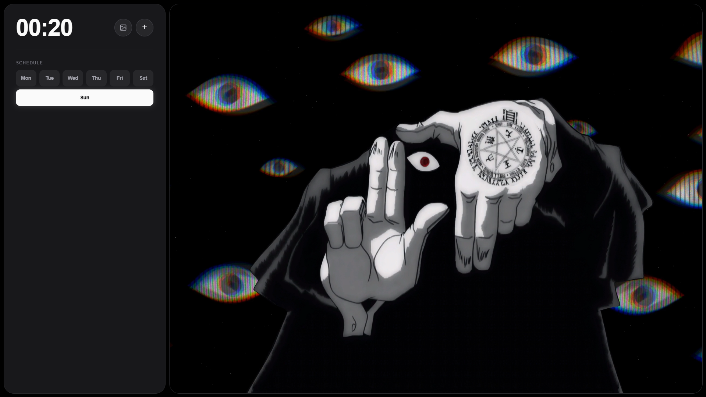

# Modern Day Tracker & Todo Manager 🌟

A minimalist yet powerful daily task tracker with real-time updates and visual progress indicators.

## 🎯 Key Features

- Live Clock (24h HH:MM format, zinc styled)
- Year Progress Grid (past / current / future days)
- Weekly Schedule Panel (Sun–Sat quick task access)
- Dual Task Modes (Weekly tasks + Day-of-year tasks)
- Shortcut Manager (favicon linked quick launch icons)
- Wallpaper System (URL image/video or local image upload)
- IndexedDB storage for large local wallpaper files
- Drag-and-Drop Task Ordering
- Inline Title Edit (double-click)
- Task Detail Viewer
- Favicon Auto-Fetch (Google service fallback)
- Zinc Theme UI (neutral dark palette)

## 🖼 Wallpaper Management

- Open wallpaper modal via:
  - Change icon button
  - Double-click empty background area
- Set from URL (supports images or MP4/WebM/Ogg/MOV video)
- Upload local image (IndexedDB persisted)
- Automatic type detection (image vs video)
- Reset to default Unsplash image
- Large file support via IndexedDB (avoids localStorage limits)

## ⚡ Shortcuts

- Click + button next to clock to open shortcut modal
- Add (Name + URL) – favicon auto-fetched
- Compact circular favicon pills under clock
- Delete shortcuts from modal
- Stored in localStorage (persistent)

## 📅 Weekly Schedule

- Separate weekly task list keyed by `todo_week_<dayIndex>`
- Current day highlighted (light zinc)
- Indicator dot for days with tasks
- Double-click task title to edit
- View / Delete actions per item

## 📆 Year Grid

- Dynamically rendered 365/366 day boxes
- Current day highlighted (white pulse effect via box-shadow)
- Small indicator dot for days with tasks (`todo_day_<n>`)

## 🛠 Technical Notes

- localStorage: tasks + shortcut metadata + wallpaper meta
- IndexedDB: stored binary of uploaded wallpaper (large files)
- Dynamic event delegation (minimal inline handlers)
- Graceful fallback SVG if favicon fails

## 🔄 Data Keys

- Weekly tasks: `todo_week_0` … `todo_week_6`
- Year day tasks: `todo_day_1` … `todo_day_365|366`
- Shortcuts: `shortcuts`
- Wallpaper meta: `user_wallpaper_meta`
- IndexedDB store: `current_wallpaper`

## 📝 Usage Tips

- Double-click background to quickly open wallpaper settings
- Rotate + button (animation) indicates interaction
- Drag tasks to reorder priority
- Hover year boxes for tooltips (via title attr)
- Minimal footprint; all data local

## 🔜 Upcoming Features

- [ ] Export / Import (tasks + shortcuts + wallpaper meta)
- [ ] Weekly summary / analytics
- [ ] Optional milliseconds toggle for clock
- [ ] Theme variants (emerald / slate / rose)
- [ ] Global search across tasks
- [ ] Tagging & filters

## 🤝 Contributing

1. Fork the repository
2. Create feature branch
3. Commit changes
4. Push to branch
5. Open pull request

## 📝 License

MIT License - Open source and free to use

---

💻 [View Code](https://github.com/kanishk1122/home_tab)
🌐 [Live Demo](https://kanishk1122.github.io/home_tab/)
🐛 [Report Bug](https://github.com/kanishk1122/home_tab/issues)
