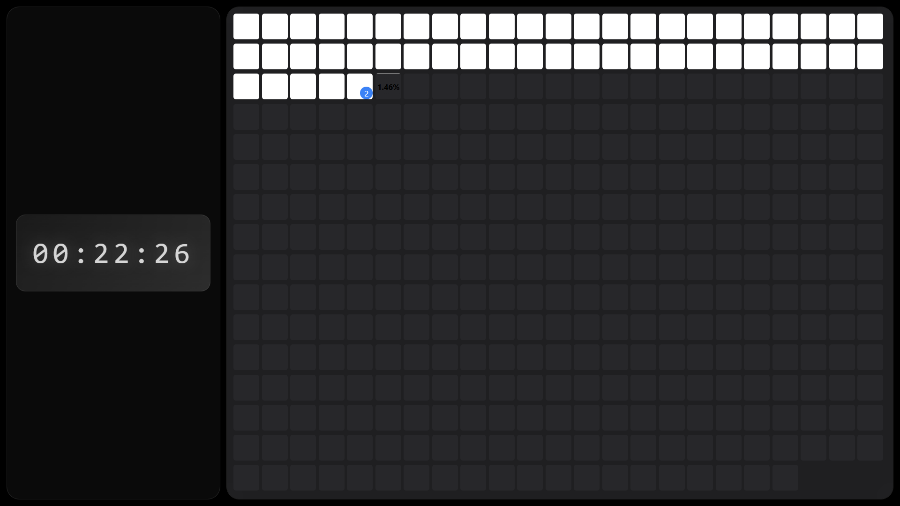

# Modern Day Tracker & Todo Manager 🌟



A minimalist yet powerful daily task tracker with real-time updates and visual progress indicators.

## 🎯 Key Features

- **Live Clock Display**

  - Millisecond precision
  - Clean, minimalist design
  - Responsive sizing across devices

- **Visual Year Progress**

  - Interactive day blocks
  - Real-time progress tracking
  - Color-coded status indicators
  - Hover effects and tooltips

- **Task Management**
  - Daily task organization
  - Drag-and-drop prioritization
  - Quick edit functionality
  - Task count indicators
  - Detailed task views

## 🚀 Quick Start

1. **Setup Options:**

   - Use hosted version: [Live Demo](https://kanishk1122.github.io/home_tab/)
   - Download and run locally
   - Set as browser homepage

2. **Local Installation:**

   ```bash
   git clone https://github.com/kanishk1122/home_tab.git
   cd home_tab
   ```

3. **Browser Setup:**
   - [Detailed Browser Setup Guide](BROWSER_SETUP.md)
   - Works with Chrome, Firefox, Edge, and Safari

## 💻 Interface Guide

### Time Display

- Left panel shows current time
- Updates in real-time
- 24-hour format with milliseconds
- Responsive sizing

### Day Grid

- White blocks: Past days
- Gradient block: Current day
- Dark blocks: Future days
- Hover for day number
- Click to manage tasks

### Task Management

- Click any day to open task manager
- Add tasks with title and description
- Drag to reorder priority
- Quick view and edit options
- Task count badges

## 🎨 Design Features

- Dark theme optimized
- Blur effects and gradients
- Smooth animations
- Responsive layout
- Mobile-friendly design

## ⚡ Performance

- Lightweight implementation
- Local storage for data
- No external dependencies
- Fast loading times
- Offline functionality

## 🔧 Technical Details

- Pure HTML/CSS/JavaScript
- Local storage for persistence
- Responsive grid system
- CSS Grid and Flexbox layout
- Custom scrollbar styling

## 📱 Device Support

- **Desktop:** Full support
- **Tablet:** Optimized layout
- **Mobile:** Responsive design
- **Minimum width:** 320px
- **Recommended:** 768px+

## 🔜 Upcoming Features

- [ ] Theme customization
- [ ] Data export/import
- [ ] Task categories
- [ ] Search functionality
- [ ] Task statistics

## 🤝 Contributing

1. Fork the repository
2. Create feature branch
3. Commit changes
4. Push to branch
5. Open pull request

## 📝 License

MIT License - Open source and free to use

---

💻 [View Code](https://github.com/kanishk1122/home_tab)
🌐 [Live Demo](https://kanishk1122.github.io/home_tab/)
🐛 [Report Bug](https://github.com/kanishk1122/home_tab/issues)
